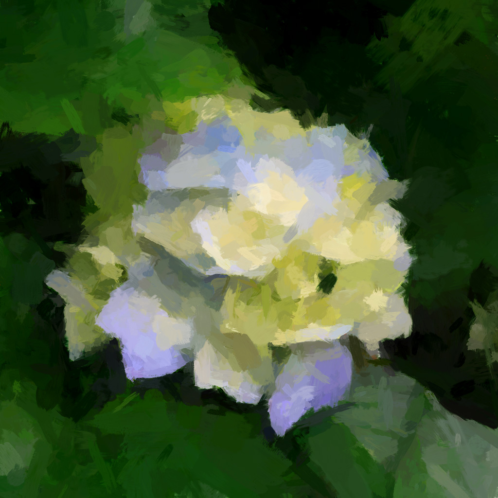
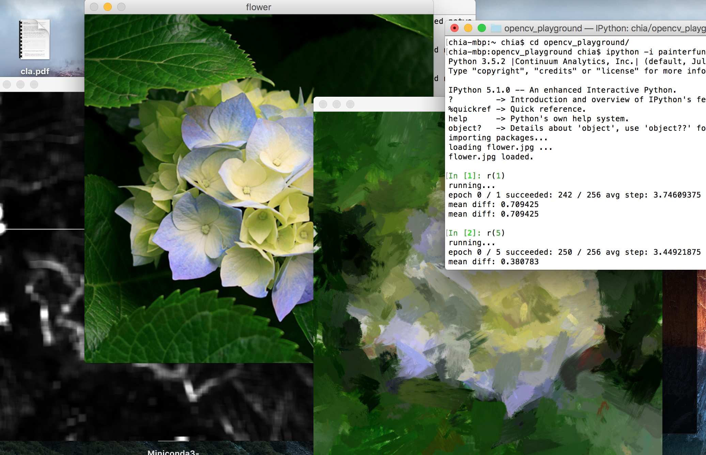
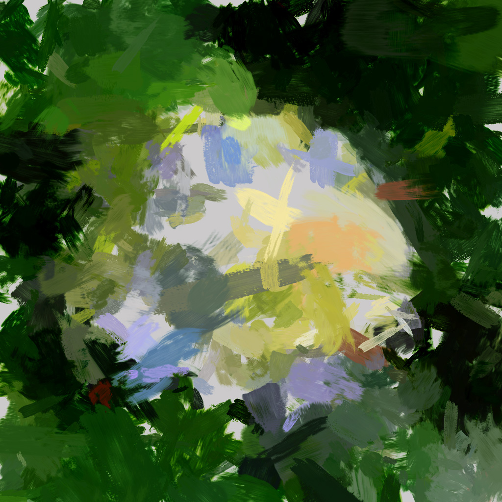
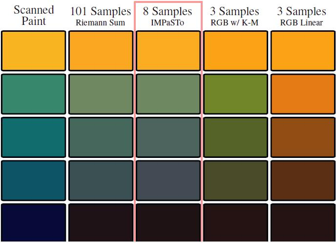
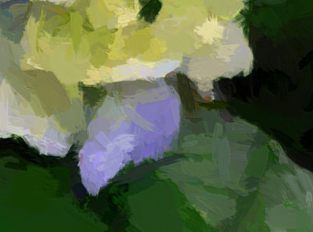

# opencv_playground

You might be looking for the oil paint synthesizer.



# painterfun.py

1. install Anaconda/Miniconda environment for Python 3 . <https://www.continuum.io/downloads#windows>
2. install OpenCV for Python

    - if you know what you're doing: `pip install opencv-python`

    - if you are on Windows and are out of luck: Download the version of `opencv-python` for your architecture from <https://www.lfd.uci.edu/~gohlke/pythonlibs/> then `pip install opencv.....amd64.whl`.

        (If you're using OS X, there are prebuilt packages of opencv-python on `conda`)
        
3. (must) install threadpool: `pip install threadpool`
4. `ipython -i painterfun.py` to run the program

After step 4 you can start typing code.

by default, `flower.jpg` is loaded. to switch to another image, run `load('another.jpg')`

`r(1)` will try once to put 512 strokes onto the canvas. Then the canvas, original, and the error image will be displayed.

you may execute `r(1)` multiple times.

`r(10)` will try 10 times. that's a lot of strokes!



canvas will be autosaved under /[name of the image file]/ directory between tries. You will be noticed from the CLI.

`hist` variable holds all stroke history.

`repaint(upscale=1)` will paint a new canvas according to the stroke history and return the painted image.

set upscale = 2 to paint a 2x larger image. (will display a smaller version of it, in case it exceeds the size of your screen.

to save the repainted image:

`img = repaint()`, then `cv2.imwrite('abc.png',img)`

# colormixer.py



How can you render realistic oil paint strokes? You can't just do simple alpha compositions.

- Physically-Based Modeling Techniques for Interactive Digital Painting

  by William Valentine Baxter III

  p 155-159

per his paper: you can't mix oil colors by their RGB appearance.

```python
mix = c1/2 + c2/2 # won't work.
```

Physically, you have to mix the oil colors' absorbance wavelength by wavelength, layer by layer, then do the multiplication. It's okay, but too slow, and I don't care about layers of paint.




So here I present a simpler model:

assume the total absorbance `tabs` of some oil color paint with an appearance `c1` (RGB vector from 0.0 to 1.0), we can then calculate `tabs` as follows:

```py
tabs = 1.0 - c1
```

If `c1 == [1.0,1.0,1.0]` (white), the material does not absorb any portion of incoming  light. Higher `tabs` gets you darker color.

then, assume total absorbance `tabs` is related to unit-depth absorbance `uabs` according to the following rule:
```py
tabs = uabs ** k
# or
uabs = tabs ** (1/k)
```

Glass is a good example: Thin glass looks transparent while thick glass looks darker, because total absorbance = (unit-depth absorbance) ^ depth.

Oil colors are just pigment particles floating in lime oil, so this simple hypothesis worked just fine.

Here's the function used to convert RGB to UABS space:

```py
def submix_power(i):
    i = np.array(i)

    def BGR2PWR(c):
        c = np.clip(c,a_max=1.-1e-6,a_min=1e-6) # no overflow allowed
        c = np.power(c,2.2/i)
        u = 1. - c
        return u # unit absorbance

    def PWR2BGR(u):
        c = 1. - u
        c = np.power(c,i/2.2)
        return c # rgb color

    def submix(c1,c2,ratio):
        uabs1,uabs2 = BGR2PWR(c1),BGR2PWR(c2)
        mixuabs = (uabs1 * ratio) + (uabs2*(1-ratio))
        return PWR2BGR(mixuabs)

    return submix,BGR2PWR,PWR2BGR
```

where `i` is the depth factor `k` in the formula above.

however, since pigment particles with the same appearance can have very different spectral absorbance, using 3 numbers for `i` will only work for some color combinations. To achive physically correct color, consider the 8-channel color model (read the paper above).

the `i` chosen for this project:

```py
def oilpaint_converters():
    submix,b2p,p2b = submix_power(f32([13,3,7.]))
    return b2p,p2b
```

So, to mix 2 color images in the UABS space:

```py
from colormixer import oilpaint_converters
b2p,p2b = oilpaint_converters()
image1,image2 = b2p(image1),b2p(image2)
mixed = image1*alpha + image2*alpha
result = p2b(mixed)
```

# add more style

Photoshop -> Duplicate Layer -> Filter: Emboss -> clip output into 108...144 -> Layer Mode: Linear Light -> reduce layer Fill a little bit

there you go:



however, this is not the correct way to do it.

you'll need a height map generated by stacking brush patterns. I might add that in the future.

# License

Copyright 2020 Qin Yongliang

Permission is hereby granted, free of charge, to any person obtaining a copy of this software and associated documentation files (the "Software"), to deal in the Software without restriction, including without limitation the rights to use, copy, modify, merge, publish, distribute, sublicense, and/or sell copies of the Software, and to permit persons to whom the Software is furnished to do so, subject to the following conditions:

The above copyright notice and this permission notice shall be included in all copies or substantial portions of the Software.

THE SOFTWARE IS PROVIDED "AS IS", WITHOUT WARRANTY OF ANY KIND, EXPRESS OR IMPLIED, INCLUDING BUT NOT LIMITED TO THE WARRANTIES OF MERCHANTABILITY, FITNESS FOR A PARTICULAR PURPOSE AND NONINFRINGEMENT. IN NO EVENT SHALL THE AUTHORS OR COPYRIGHT HOLDERS BE LIABLE FOR ANY CLAIM, DAMAGES OR OTHER LIABILITY, WHETHER IN AN ACTION OF CONTRACT, TORT OR OTHERWISE, ARISING FROM, OUT OF OR IN CONNECTION WITH THE SOFTWARE OR THE USE OR OTHER DEALINGS IN THE SOFTWARE.
